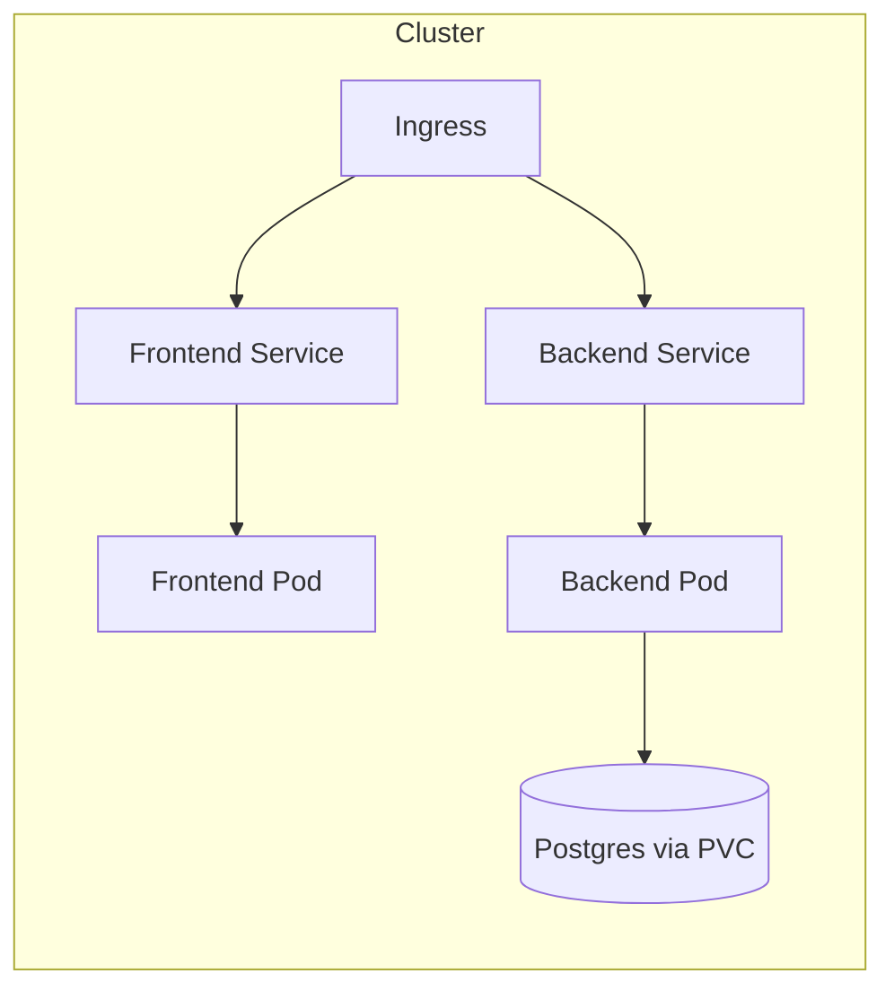
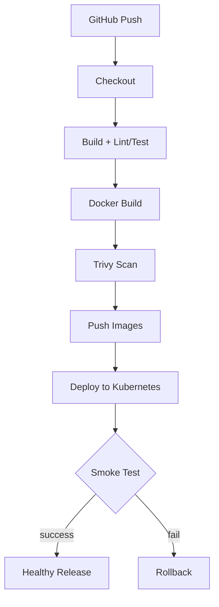
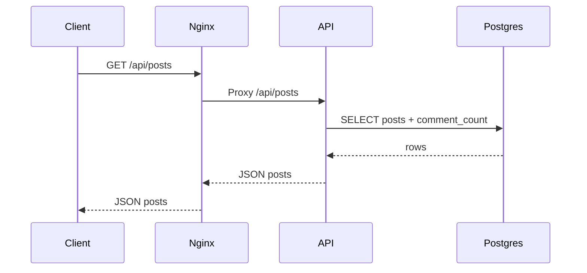
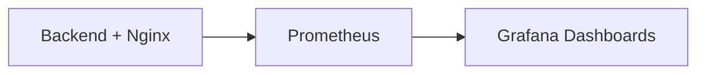
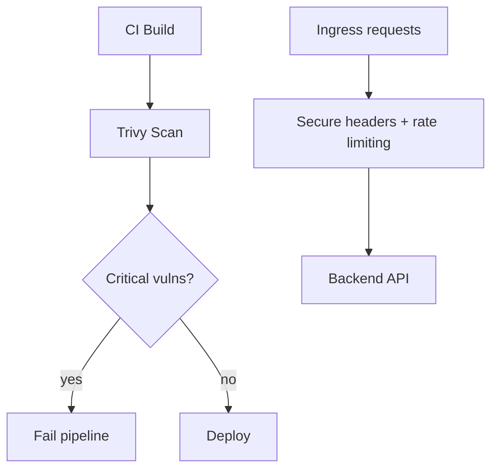

# ARCHITECTURE.md — Architecture & Diagrams (Mermaid)

Jerney uses a layered architecture with clear separation of concerns:
- **Frontend**: React SPA served by Nginx
- **Backend**: Node.js/Express API
- **Database**: PostgreSQL

---

## 1) High-Level Architecture Diagram

```mermaid
flowchart LR
  U[Users / Browsers] -->|HTTP| FE[Frontend (React + Nginx)]
  FE -->|/api/*| BE[Backend API (Node.js/Express)]
  BE -->|SQL| DB[(PostgreSQL)]
```

### Why each component is used
- **Frontend**: fast UI delivery, independent scaling, SPA UX.
- **Backend**: encapsulates business logic + validation and provides stable API.
- **PostgreSQL**: relational data model for posts/comments, supports integrity constraints.

---

## 2) Docker Architecture

```mermaid
flowchart TB
  DB[postgres:16-alpine] --> BE[jerney-backend]
  BE --> FE[jerney-frontend (nginx)]
```

---

## 3) Kubernetes Architecture



---

## 4) CI/CD Pipeline Diagram



---

## 5) Network Flow Diagram

```mermaid
flowchart LR
  Client[Client] -->|GET /| Nginx[Nginx (frontend)]
  Client -->|GET /api/*| Nginx
  Nginx -->|proxy_pass| Backend[Express API]
  Backend --> Postgres[(Postgres)]
```

---

## 6) Request Flow Diagram



---

## 7) Monitoring Architecture



---

## 8) Security Flow



---

## Component explanations (quick)
- **Frontend**: React UI, served behind Nginx.
- **Backend**: Express routes with PostgreSQL queries.
- **PostgreSQL**: durable storage for posts/comments.
- **Docker**: consistent packaging for local and CI.
- **Kubernetes**: scalable orchestration (Deployments, Services, Ingress).
- **Ingress**: external routing.
- **ConfigMap**: non-sensitive config.
- **Secret**: sensitive credentials.
- **Persistent Volume**: underlying storage.
- **Services**: stable networking.
- **Pods**: runtime units.
- **Deployments**: desired state and rollouts.
- **GitHub Actions**: CI/CD automation.
- **Trivy**: vulnerability scanning.
- **Prometheus/Grafana**: monitoring.

